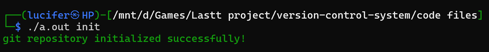
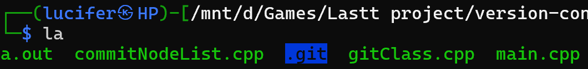
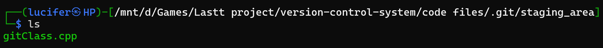

# 🔄 Version Control System (VCS)
----

## 📌Introduction

Thank You to Uzairahmednasir for making this amazing project.  
We are TEAM ENIGMA from DAU.  
We have reaserched on this version-control-system project and its working under the course IT206 of DAU.  
This project replicates some basic functions of version-control-systems like Git.  

---

## 🚀 Features

- 🗂️ `init`: Initialize a new repository
- ➕ `add <filename>`: Stage files for the next commit
- ✅ `commit <message>`: Commit changes with a message
- 📜 `log`: View commit history
- ⏪ `revert <commit_id>`: Revert to a previous version
- 🧱 Organized structure using standard C++ and file I/O
---

## 🧰 Tech Stack

- 👨‍💻 Language: **C++**
- 📁 Concepts: File I/O, OOP, DSA
- 🧠 Design: Modular, Lightweight, Educational

---

## 📁 Project Structure
```
🔄 version-control-system
 └──  Code Files                    → 💻Code Files 
        └── main.cpp
        └── commitNode.cpp
        └── gitClass.cpp

 └──  slides dsa project.pdf        → ❤️‍🔥From Creator   
 └──  README.md                     → 📄Project documentation
 └──  working.png                   → 📸 Screenshot of the application
```
---
# Data Strcures Used

| Data Structure Used                   | Feature            |
|---------------------------|-------------------------------|
| Singly Linked List            | To maintain a chronological list of commits            |
| Array of strings| For adding multiple specific files to staging              |
| Filesystem library (iterator)    | Traverse and copy files from working dir(like a directory traversal tool) |
| String    | Used for file paths, commit IDs, messages, dates                       |

## ⚡ Getting Started

### 🧱 Prerequisites

- Linux/Mac OS or WSL
- A working C++ compiler (e.g., `g++`)

### 🛠️ Build Instructions

Compiling
```
g++ main.cpp
```

Commands (Note : Provide complete path of the file or open terminal in the folder where your file is.)
```
./a.out init                          # Initialize a new repo
./a.out add notes.txt                 # Stage a file
./a.out commit -m "Commit Messege"    # Commit with a message
./a.out log                           # View commit history
./a.out revert <commit_id>            # Go back in time ⏳
```
----
# Complete Procedure for running

**Step 1: Compiling**
```
g++ main.cpp
```
**Step 2: Initializing Empty Repository**  
**NOTE:-** I am using wsl, if you are using Linux, a new hidden folder of ".git" will get created. You can check it by "la" command.
```
./a.out init
```


**NOTE:-** Inside .git two new folders **commits** and **staging_area** are created, check them out by "ls" command.

**Step 3: Add files to staging_area**
For example I am adding "gitClass.cpp" in staging_area.
```
./a.out add gitClass.cpp
```



